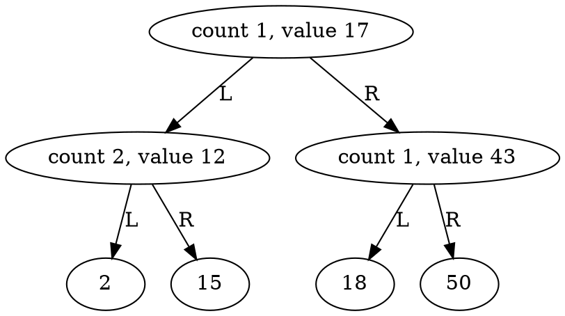

## Exercises for 17 Jun 2020

1. Discuss the merits of using `std::shared_ptr` vs `std::unique_ptr` to manage the ownership of child nodes in a tree.

   Here are functions of unique_ptr and shared_ptr.

   1. unique_ptr: allows only one owner of the underlying pointer
   2. shared_ptr allows multiple owners of the same pointer (Reference count is maintained)

   Considering the definition of the tree. The pointer points to the child is better to use unique_ptr. Since the child only has one parent node. 

2. Implement a tree ADT (*abstract data type*) in which each node can have an arbitrary number of children. Implement the following methods to populate your tree. Write test code to build a tree with some pre-defined structure and use a debugger to verify that the tree has the structure you intended.

   ```C++
   /**
    * Set the value of the tree's root node.
    */
   Tree& setRoot(T value);
   
   /**
    * Add a leaf node to the top level of this tree.
    */
   Tree& addChild(T value);
   
   /**
    * Add a subtree to the top level of this tree, using move
    * semantics to "steal" the subtree's nodes.
    */
   Tree& addSubtree(Tree<T>&&);
   ```

## Exercises for 19 Jun 2020

Consider the alternate child-and-sibling structure [described here](https://memorialu.gitlab.io/Engineering/ECE/Teaching/data-structures/website/modules/trees/child-and-sibling/).

1. Does this necessitate a change to your smart-pointer strategy (using `std::shared_ptr` or `std::unique_ptr`)? Why or why not?

   No. I can still use unique_ptr. because every sibling only points to one child.

2. Re-implement your tree data structure to use the child-and-sibling node structure.

   All changes are in Node class. the addChild method is changed. a new method named addSibling is added.  Two field: child_ and sibling_ are added.

## Exercises for 25 Jun 2020

1. Implement pre- and post-order traversal in your tree data structure, passing an instantiation of the following function template to your traversal method (i.e., your test code should call something like `myTree.visitPreorder(visit<double>)`):

   ```C++
   template<typename T>
   void visit(const T &value)
   {
   	static size_t i = 0;
   	std::cout << "Node " << i++ << ": " << value << "\n";
   }
   ```

   pseudocode:

   ```python
   def visit_preorder(node, fn):
   	if node is None:
   		return
   	
   	fn(node)
   	for child in children:
   		visit_preorder(child, fn)
   
   def visit_postorder(node, fn):
   	if node is None:
   		return
   	
   	for child in children:
   		visit_preorder(child, fn)    
       fn(node)
   ```

   

2. [optional] Implement level-order traversal for your tree data structure. You may find the [queue-based algorithm described on Wikipedia’s "Tree Traversal" page](https://en.wikipedia.org/wiki/Tree_traversal#Breadth-first_search_2) to be helpful.

   skip

## Exercises for 3 Jul 2020

Given the partial `BinarySearchTree` class template in [BST.h](https://memorialu.gitlab.io/Engineering/ECE/Teaching/data-structures/website/modules/trees/exercises/BST.h), the stub test code in [bst-test.cc](https://memorialu.gitlab.io/Engineering/ECE/Teaching/data-structures/website/modules/trees/exercises/bst-test.cc) and the provided [Makefile](https://memorialu.gitlab.io/Engineering/ECE/Teaching/data-structures/website/modules/trees/exercises/Makefile):

1. Implement the `insert`, `Node::min` and `Node::max` methods recursively.

   see code in BST.h

2. Implement the `BinarySearchTree::print` method using a recursive `Node::print` method.

   see code in BST.h

3. [optional] Instantiate a binary search tree to contain more interesting objects (e.g., transcript objects that contain vectors of course result objects) and with a non-trivial comparison function (e.g., one that compares the mark in a specific course between two transcripts). Change the "keep a count of duplicates" approach in the given `Node` to instead keep a linked list of "duplicates" (which may not be entirely identical, merely identical in one course).

   skip

## Exercises for 6 Jul 2020

Continue working on the BST example code:

1. Implement and test the `Node::contains` and `Node::maxDepth` methods.

   see code in BST.h

2. Implement the recursive `Tree<T, Comparator>::remove()` method.

   see code in BST.h

3. [optional] Implement a method in `Node` with the following signature and use it in a version of `Tree<T, Comparator>::remove()` with move semantics:

   ```C++
   /**
    * Find the minimum node in a subtree and remove it, returning it by value.
    */
   T takeMin();
   ```

4. [optional] One way to avoid the cost of removing nodes is to not *really* remove them at all. In this approach, you simply mark deleted nodes as deleted and ignore them when you search through the tree. If the same value is ever added to the tree again, it doesn’t need to be re-created, it just needs its "removed" mark removed.

   1. This approach trades of the work of removal against extra work on searching and (sometimes) insertion — in what sorts of situations might this approach be net beneficial or net harmful?
   2. Re-implement your `remove()` method using this "mark as removed" approach.

## Exercises for 8 Jul 2020

### VisuAlgo

Using the [VisuAlgo BST visualizer](https://visualgo.net/en/bst), construct the following trees by creating an empty tree and then inserting nodes in the appropriate order. Submit screenshots of your work to Subversion.

**For extra challenge**, plan all of the nodes that you need to insert and the order in which they should be inserted **before** adding any nodes; then add them all at once as a comma-separated list.

1. Degenerate trees:
   1. A linked list of eight nodes, in which each node is found to the left of its parent.
   2. A linked list of six nodes that "zig-zags", i.e., to get from the root to the (only) leaf, you follow the root’s `left` pointer, then that node’s `right` pointer, then `left`, etc.
2. A tree that stores all of your final course marks as they appear on your transcript, added **in chronologial order**.
3. A tree that stores all of your final course marks as they appear on your transcript, added in an order that will make the tree **approximately balanced**.

### GraphViz

Open [Graphviz Online](https://dreampuf.github.io/GraphvizOnline) and input the following graph description into it:



Although [GraphViz](http://graphviz.org/) and its [DOT language](https://graphviz.gitlab.io/_pages/doc/info/lang.html) can be used to draw very complicated graphs, you can see that the syntax required to draw a tree is quite straightforward. Use this syntax in the following new methods and test your work.

```C++
template<...>
class BST
{
	/* ... */

	/**
	 * Output this tree in a GraphViz DOT representation as a
	 * directed graph ("digraph").
	 *
	 * Calls to this method will cause an entire graph (starting
	 * with "digraph G {") to be output to the given std::ostream.
	 *
	 * @param   o    the output stream to write to
	 */
	void printDot(std::ostream &o) const;

	/* ... */

	class Node
	{
		/* ... */

		/**
		 * Output information about this node in GraphViz DOT format.
		 *
		 * This will output information about this node
		 * (with no graph-level decorations such as "digraph G {")
		 * and recursively descend to its children.
		 */
		void printDot(std::ostream&) const;
	};
};
```

Of course, if you want to get *really* fancy, you can output DOT like [this](https://gist.github.com/trombonehero/e74b775692d7a0b6e03b257880ad4257)…

## Exercises for 10 Jul 2020

1. Implement a method to rotate a subtree, either to the left or to the right. Use your previously-implemented GraphViz DOT output to test it. What is its algorithmic complexity?
2. Create a subclass of the `BinarySearchTree` class that implements AVL rebalancing when you perform a left-left or a right-right insertion that puts a subtree out of balance. What is the algorithmic complexity of this new `insert` method?

[
  ](https://memorialu.gitlab.io/Engineering/ECE/Teaching/data-structures/website/modules/trees/avl/)